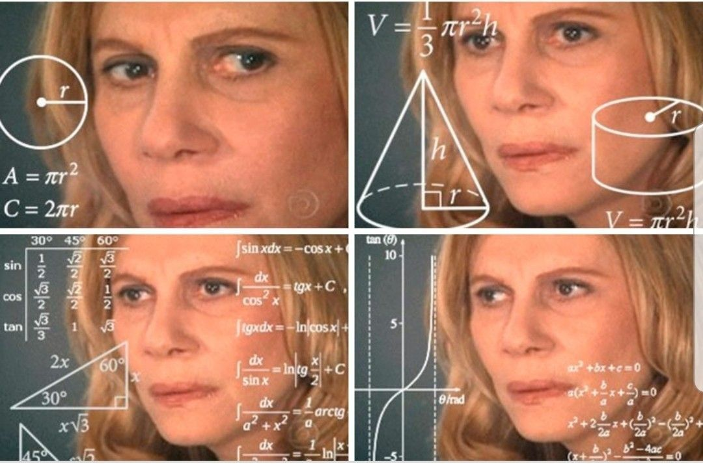

# Wobblr - Robot Sensor Analytics

A robotics-focused sensor analytics and performance analysis system that combines numerical computing, statistical analysis, kinematics, signal processing, and data visualization to extract meaningful insights from robot sensor data.

## Features

- Sensor data analysis
- Statistical analysis
- Data visualization
- Robot performance metrics
- Numerical analysis

## Tech Stack

- Python
- NumPy
- Pandas
- Matplotlib
